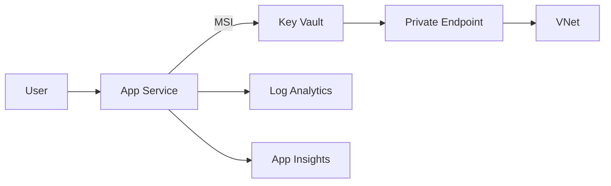

# Terraform - Azure - AppService

## Create infrastructure for an Azure AppService with the following:
- VNet and subnets
- Private DNS Zone for private Key Vault 
- Key Vault with private endpoint
- App Service with System Assigned Manged Identity
- Key Vault Secret + App Service Key Vault reference
- Log Analytics and Application Insights
- Diagnostics streaming to Log Analytics

## Design

## Create Keyvault and secret 
Terraform will not create the Keyvault and Secret.
Not recommended due to security concerns.
Example for KV create and secret:
```
KV_NAME="<keyvault name>"
SECRET_NAME="<secret name>"
DEMO_PWD="<password>"
az keyvault secret set --vault-name "$KV_NAME" --name "$SECRET_NAME" --value "$DEMO_PWD"
```

## How to run locally
```
az login
az account set --subscription <id>

cd environments/dev
terraform init
terraform plan -out tfplan
terraform apply tfplan
``` 